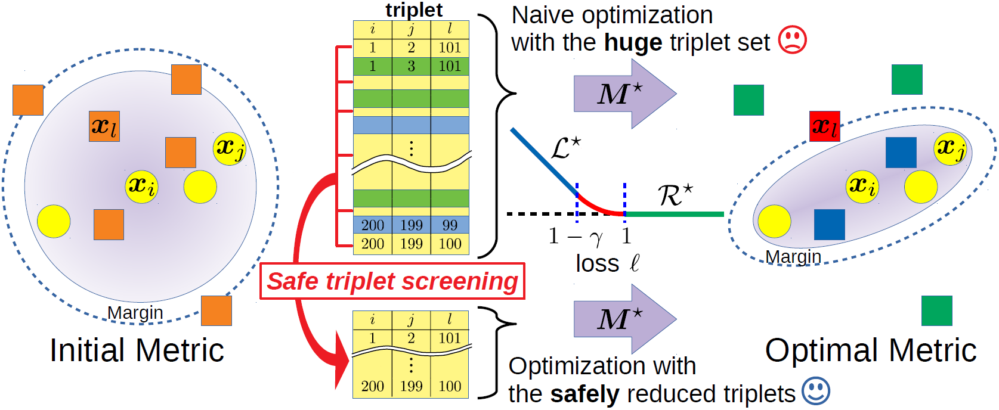

# Safe Triplet Screening for Distance Metric Learning
Source code for KDD2018 accepted paper "[Safe Triplet Screening for Distance Metric Learning](https://www.kdd.org/kdd2018/accepted-papers/view/safe-triplet-screening-for-distance-metric-learning)"

arXiv: https://arxiv.org/abs/1802.03923

## Abstract

<div align="center">
    
</div>

We study safe screening for metric learning. Distance metric learning can optimize a metric over a set of triplets, each one of which is defined by a pair of same class instances and an instance in a different class. However, the number of possible triplets is quite huge even for a small dataset. Our safe triplet screening identifies triplets which can be safely removed from the optimization problem without losing the optimality. Compared with existing safe screening studies, triplet screening is particularly significant because of (1) the huge number of possible triplets, and (2) the semi-definite constraint in the optimization. We derive several variants of screening rules, and analyze their relationships. Numerical experiments on benchmark datasets demonstrate the effectiveness of safe triplet screening.

## Programs

There are five programs as follows:
- SafeScreening
- SafeScreening+ActiveSet
- SafeScreening+ActiveSet+RangeBasedExtension
- SafeScreening+ActiveSet+RangeBasedExtension+ErrorRate
- SafeScreeningDualSolver

Each program needs C++ [Eigen](http://eigen.tuxfamily.org/index.php?title=Main_Page) library. 

Each directory has `Makefile`, but you must change `INCLUDE` variable in it as follows:
```
INCLUDE  =  -I[your Eigen library path]
```
After that, type `make`, and compile will begin. 

### SafeScreening
This program enables us to confirm a screening rate of each bound. 

#### Usage
```
./run filename k lambda_max freq bound eps (train count)
```

- **filename**: Dataset name.
- **k**: Number of neighbor samples approaching each sample.
- **lambda_max**: First value of regularization parameter in path-wise optimization.
- **freq**: Frequency of dynamic screening.
- **bound**: Bound name. (NO, GB, PGB, DGB, RPB, RRPB, GB_LINEAR, GB_SEMIDEF, PGB_SEMIDEF, RRPB_PGB, DGB_SEMIDEF, DGB_LINEAR)
- **eps**: If a relative duality gap is less than this value, the optimization finishes.  
- **train**: Rate of training samples. The rest is used as an validation data and test data. 
- **count**: Run this number of times.

#### Example1
```
./run iris 10 10000 5 DGB 1e-6
```
The execution result is displayed on the standard output.

#### Example2
```
./run iris 10 10000 5 DGB 1e-6 0.6 5
```
The execution result is saved in `./result/`.

### SafeScreening+ActiveSet
A combination of safe Screening and active-set method.

We can use the same way as above program. 

### SafeScreening+ActiveSet+RangeBasedExtension
A combination of safe Screening, active-set method, and range based extension. 

We can use the same way as above program. 

### SafeScreening+ActiveSet+RangeBasedExtension+ErrorRate
This program enables us to confirm error rate. 

#### Usage
```
./run filename k lambda_max lambda_min freq bound eps train (count)
```
- **lambda_min**: Value of lambda changes from lambda_max to lambda_min. 

#### Example1
```
./run iris 10 10000 100 5 DGB 1e-6 0.8
```

#### Example2:
```
./run iris 10 10000 100 5 DGB 1e-6 0.8 3
```

### SafeScreeningDualSolver
The only dual solver. 

We can use the same way as `SafeScreening` program, where **bound** only supports "NO" and "PGB". 
